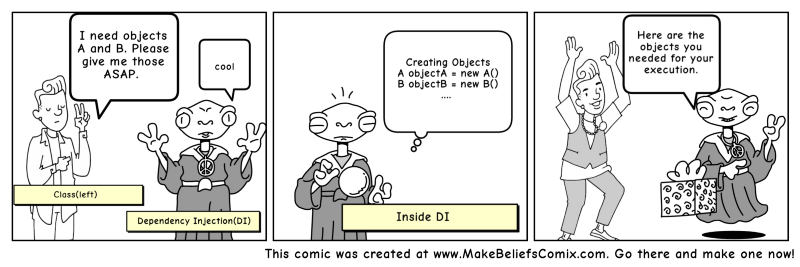

# dependency-injection

Here is an assignment to understand the dependency injection, which is done using symfony framework.
To begin with, there were some links provided by coaches to study about dependency injection.

I am going to try explaining it in my own words, maybe it also simplifies this concept for me, and makes me understand it more deeply.

## A class relying on another

When class A needs some functionality from class B, we say class A is depended on class B.

Well this far so easy and obvious...

To improve the reusability of our code, to be able to replace dependencies without changing the class that uses them, and to reduce the risk
of that we have to change a class if its dependency changed, we use dependency injection.

DI is also a design pattern to implement IoC (Inversion of Control) to try to make a class independent of its dependencies, it helps to
follow SOLID's dependency inversion , SOLID's single responsibility.

## How dependencies were injected in this project

There are three classes in transformers folder:
1. The class which capitalize every other letter in a string , implements transform interface
2. The class which turns spaces to dash, implements transform interface
3. The class which log into a file called log.info in root folder

There is a master class which is going to use all these classes' functionality. 
This means that master class is depended on them.

I made an instance of master class in DiController, and injected the dependencies through its constructor.
Since the first and second class implement transform interface, even if the methods' functionality change, the
master class will still be able to stay unchangeable. This is called constructor injection.

[//]: # (## Other ways to inject dependencies)

[//]: # ()
[//]: # (- Setter injection, define a setter method that the injector use to inject dependencies)

[//]: # (- method injection,  )

